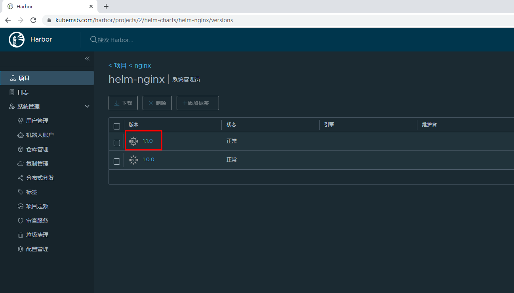

# Chart包托管至Harbor方案

需要安装helmpush插件才能上传

在线直接安装

```bash
# helm plugin install https://github.com/chartmuseum/helm-push
Downloading and installing helm-push v0.10.3 ...
https://github.com/chartmuseum/helm-push/releases/download/v0.10.3/helm-push_0.10.3_linux_amd64.tar.gz
Installed plugin: cm-push
```

```bash
# ls /root/.local/share/helm/plugins/helm-push/bin/
.  ..  helm-cm-push
```

#### 将打包应用push到harbor

```bash
# ls
Chart.yaml  templates  values.yaml
​
# vim Chart.yaml
name: helm-nginx
version: 1.1.0
​
# helm package .
Successfully packaged chart and saved it to: /helm/nginx/helm-nginx-1.1.0.tgz
[root@k8s-master01 nginx]# ls
Chart.yaml  helm-nginx-1.1.0.tgz  templates  values.yaml
```

```bash
# helm -h
The Kubernetes package manager
...
Available Commands:
  cm-push     Please see https://github.com/chartmuseum/helm-push for usage
 
# helm cm-push --username admin --password 12345 helm-nginx-1.1.0.tgz harborhelm
Pushing helm-nginx-1.1.0.tgz to harborhelm...
Done.

# helm cm-push --username admin --password 12345 helm-nginx-1.1.0.tgz harborhelm
Pushing helm-nginx-1.1.0.tgz to harborhelm...
Done.
```

\

