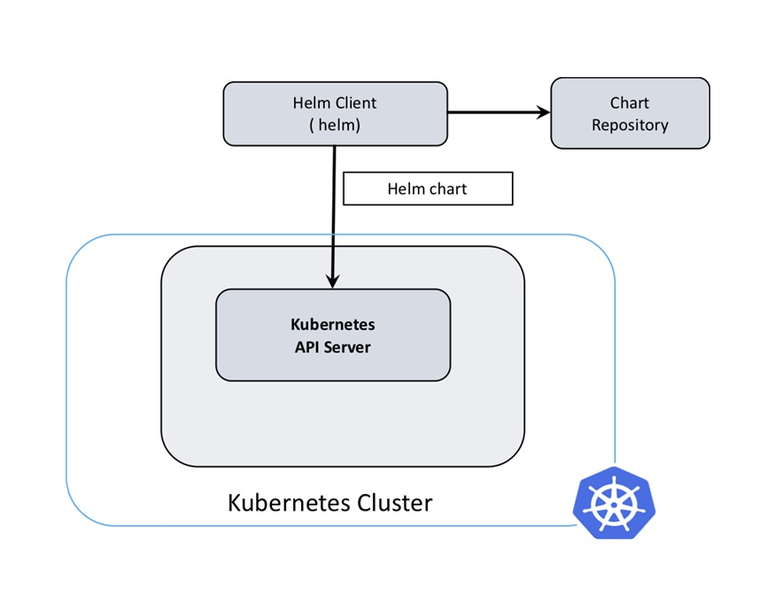

# 架构

Helm客户端使用REST+JSON的方式与K8s中的apiserver进行交互，进而管理deployment、service等资源，并且客户端本身并不需要数据库，它会把相关的信息储存在K8s集群内的Secrets中。

<figure><figcaption></figcaption></figure>

<figure><figcaption></figcaption></figure>
