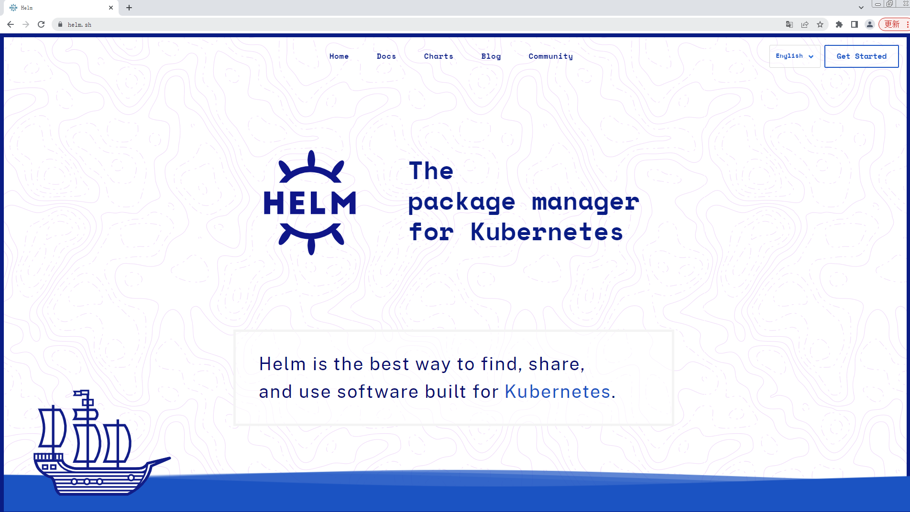

# 介绍

作为CNCF的毕业项目。它的官方的定义是：Helm是一个为K8s进行包管理的工具。

Helm将yaml作为一个整体管理并实现了这些yaml的高效复用，就像Linux中的yum或apt-get，它使我们能够在K8s中方便快捷的安装、管理、卸载K8s应用。

<figure><figcaption></figcaption></figure>

* Helm(舵柄; 舵轮)是一个Kubernetes的包管理工具，就像Linux下的包管理器，如yum/apt等。
* helm一个命令行客户端工具，主要用于Kubernetes应用chart的创建、打包、发布和管理。
* 通过helm可以很方便的将之前打包好的yaml文件部署到kubernetes上。
* 对于应用发布者而言，可以通过Helm打包应用，管理应用依赖关系，管理应用版本并发布应用到软件仓库。
* 对于使用者而言，使用Helm后不用需要了解Kubernetes的Yaml语法并编写应用部署文件，可以通过Helm下载并在kubernetes上安装需要的应用。
* 除此以外，Helm还提供了kubernetes上的软件部署，删除，升级，回滚应用的强大功能。
* Helm 社区已经维护了一个官方 Helm Hub，我们可以直接使用已经做好的 Helm Chart，部署和管理比较复杂的应用程序
* 早期的hub.helm.dev转移到了[https://artifacthub.io/](https://artifacthub.io/)。
