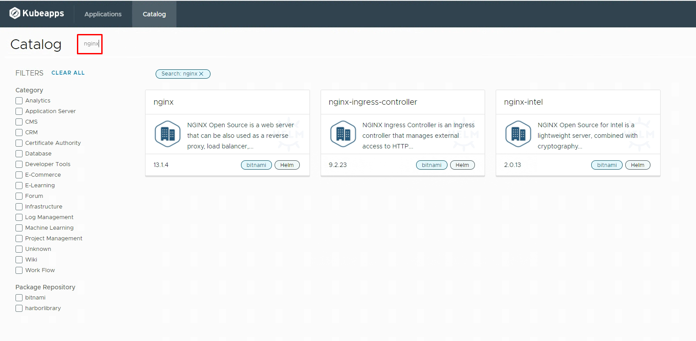
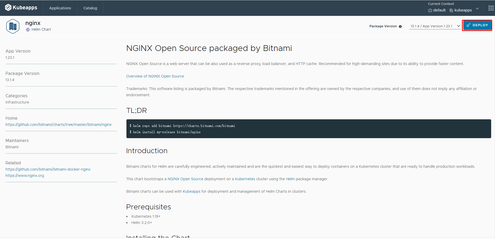
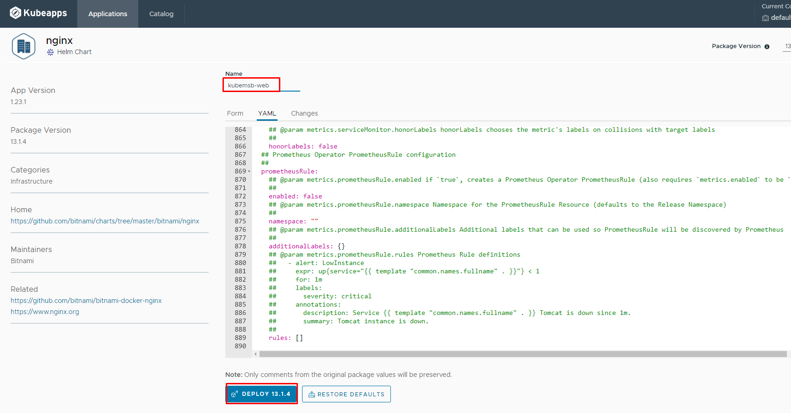
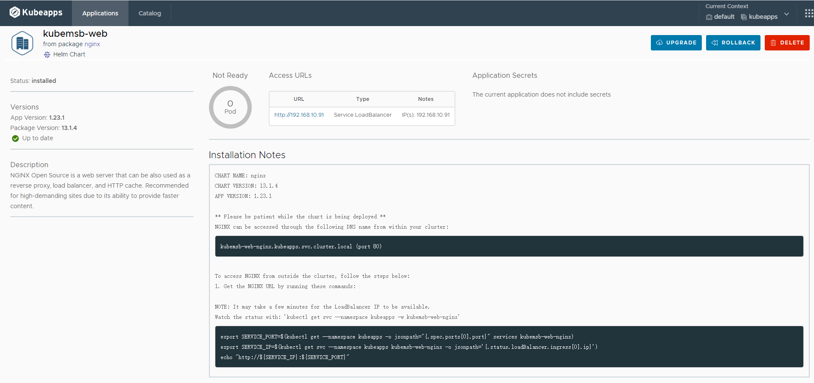

# 部署nginx

<figure><figcaption></figcaption></figure>

<figure><figcaption></figcaption></figure>

<figure><figcaption></figcaption></figure>

<figure><figcaption></figcaption></figure>

\[root@k8s-master01 nginx]# kubectl get pods -n kubeapps NAME READY STATUS RESTARTS AGE ...... kubemsb-web-nginx-55fdb5bfd6-4cfpg 1/1 Running 0 57s
