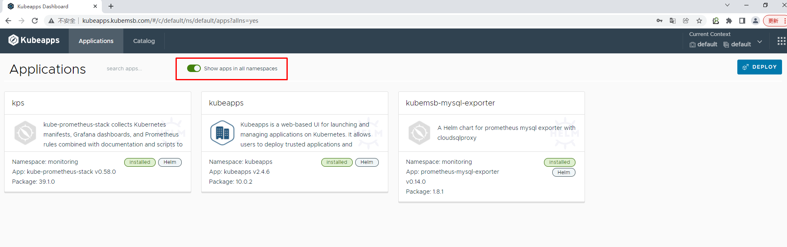
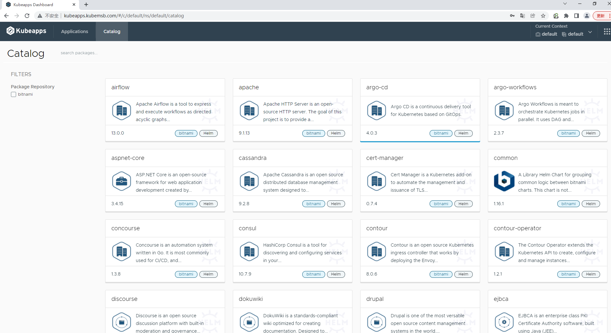

# 访问kubeapp

```bash
# vim kubeapps-ingress.yaml

# cat kubeapps-ingress.yaml
apiVersion: networking.k8s.io/v1
kind: Ingress
metadata:
  name: ingress-kubeapps                    #自定义ingress名称
  namespace: kubeapps
  annotations:
    ingressclass.kubernetes.io/is-default-class: "true"
    kubernetes.io/ingress.class: nginx
spec:
  rules:
  - host: kubeapps.kubemsb.com                   # 自定义域名
    http:
      paths:
      - pathType: Prefix
        path: "/"
        backend:
          service:
            name: kubeapps     # 对应上面创建的service名称
            port:
              number: 80
```

```
# kubectl apply -f kubeapps-ingress.yaml
ingress.networking.k8s.io/ingress-kubeapps created
```

<figure><figcaption></figcaption></figure>



## 额外设置



**`kubectl create --namespace default serviceaccount kubeapps-operator`**



`kubectl create clusterrolebinding kubeapps-operator --clusterrole=cluster-admin --serviceaccount=default:kubeapps-operator`



```bash
# cat <<EOF | kubectl apply -f -
apiVersion: v1
kind: Secret
metadata:
  name: kubeapps-operator-token
  namespace: default
  annotations:
    kubernetes.io/service-account.name: kubeapps-operator
  type: kubernetes.io/service-account-token
EOF


输出：
secret/kubeapps-operator-token created
```

**生成token**

`kubectl get --namespace default secret kubeapps-operator-token -o jsonpath='{.data.token}' -o go-template='{{.data.token | base64decode}}' && echo`



<figure><figcaption></figcaption></figure>

<figure><figcaption></figcaption></figure>

<figure><figcaption></figcaption></figure>
