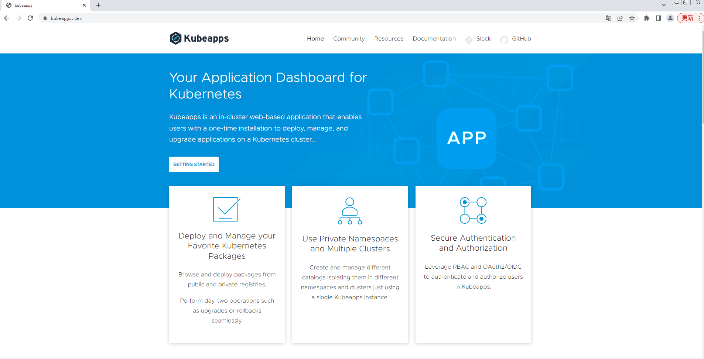

# 介绍

Kubeapps提供了一个开源的Helm UI界面，方便以图形界面的形式管理Helm应用。

* 部署应用。可从公共或私有仓库中浏览chart并将其部署到集群中；
* 管理应用。升级、管理和删除部署在kubernetes集群中的应用程序；
* 搜索功能。Kubeapps提供chart搜索页面；

<figure><figcaption></figcaption></figure>
