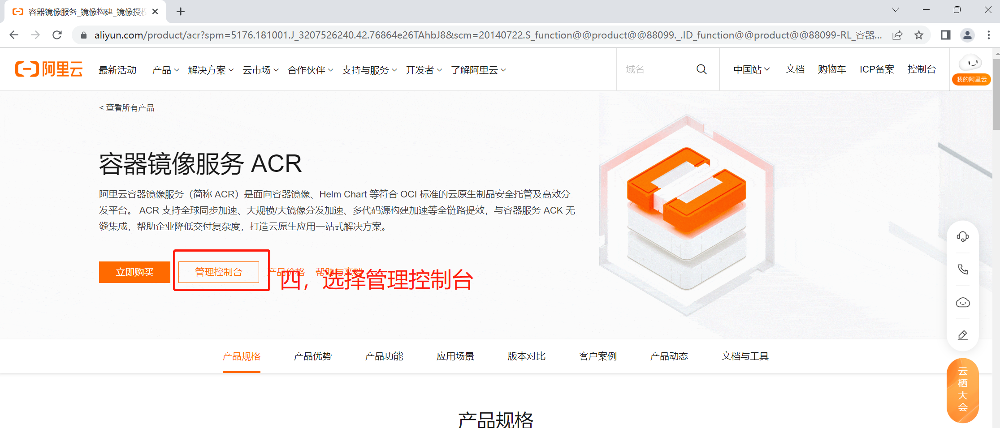

# 组合的妙用

## 提示块嵌套折叠块


## 这是提示块标题

<details>

<summary>折叠块标题1</summary>


</details>

<details>

<summary>折叠块标题2</summary>

内容

</details>


```


**提示块标题**
# 这是主标题
<details>
<summary>这是折叠块标题提</summary>
</details>


```


```


**提示块标题**
# 这是主标题
<details>
<summary>2323</summary>
</details>


```


**提示块标题**

## 这是主标题

<details>

<summary>2323</summary>

小标题

</details>


## Expandable blocks

<details>

<summary>1111</summary>

***

dwadwadwa

dwad


```



 1111 
 112211 


```


dawdawddddddddddddddddddddddddddwd


</details>

```jsx
<details>

<summary>Expandable block</summary>


</details>
```

<details>

<summary>Expandable block</summary>

1111112211

\-2222

</details>

## 提示块内嵌选项卡


**提示块标题**

## 这是主标题







2222




```


**提示块标题**
# 这是主标题


 1111 
 2222 



```

## 提示快内嵌选项卡和折叠块


**提示块标题**

## 这是主标题



<details>

<summary>32323</summary>


</details>



1111



2222




```


**提示块标题**
# 这是主标题

<details>
<summary>32323</summary>
</details>
 1111 
 2222 



```

## 选项卡嵌套折叠块



<details>

<summary>这是折叠块标题提</summary>


</details>



Here are the instructions for macOS



Here are the instructions for Linux



```



 
<details>
<summary>这是折叠块标题提</summary>
</details>


 Here are the instructions for macOS 

 Here are the instructions for Linux 



```

## 选项卡嵌套提示快与折叠块的




**提示快标题**

## 这是主标题

<details>

<summary>这是折叠块标题提</summary>


</details>




Here are the instructions for macOS



Here are the instructions for Linux



```



 

**提示快标题**
# 这是主标题
<details>
<summary>这是折叠块标题提</summary>
</details>



 Here are the instructions for macOS 

 Here are the instructions for Linux 



```

## 选项卡嵌套选项卡

```


 

**提示快标题**

 
 Here are the instructions for macOS 





 Here are the instructions for macOS 

 Here are the instructions for Linux 



```




**提示快标题**







Here are the instructions for macOS






Here are the instructions for Linux



