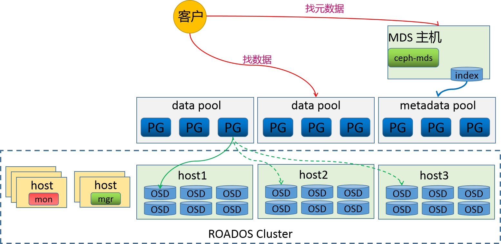

# 令牌认证

基于认证用户的唯一令牌来进行认证，有默认的超时机制，一会儿就失效了



11

```
资源定义文件方式 
# 04_kubernetes_secure_dashboard_cluster.yaml
kind: ClusterRoleBinding
apiVersion: rbac.authorization.k8s.io/v1
metadata:
  name: dashboard-admin
  annotations:
    rbac.authorization.kubernetes.io/autoupdate: "true"
roleRef:
  kind: ClusterRole
  name: cluster-admin
  apiGroup: rbac.authorization.k8s.io
subjects:
- kind: ServiceAccount
  name: dashboard-admin
  namespace: kube-system
​
---
apiVersion: v1
kind: ServiceAccount
metadata:
  name: dashboard-admin
  namespace: kube-system
  labels:
    kubernetes.io/cluster-service: "true"
    addonmanager.kubernetes.io/mode: Reconcile
    
创建资源对象
# kubectl  apply -f 04_kubernetes_secure_dashboard_cluster.yaml
clusterrolebinding.rbac.authorization.k8s.io/dashboard-admin created
serviceaccount/dashboard-admin created
```

复制token到浏览器查看效果

```
获取token信息
[root@kubernetes-master1 /data/kubernetes/secure]# kubectl describe secrets -n kube-system $(kubectl -n kube-system get secret | awk '/dashboard-admin/{print $1}')
Name:         dashboard-admin-token-4cdrd
...
token:      eyJhbG...qU3__b9ITbLHEytrA
```

<figure><figcaption></figcaption></figure>



11

```
资源定义文件方式 
[root@kubernetes-master1 /data/kubernetes/secure]# 05_kubernetes_secure_dashboard_namespace.yaml
apiVersion: v1
kind: ServiceAccount
metadata:
  name: dashboard-ns
  namespace: default
---
apiVersion: rbac.authorization.k8s.io/v1
kind: RoleBinding
metadata:
  name: dashboard-ns
  namespace: default
roleRef:
  apiGroup: rbac.authorization.k8s.io
  kind: ClusterRole
  name: admin
subjects:
- kind: ServiceAccount
  name: dashboard-ns
  namespace: default
```

11

```
创建资源对象
[root@kubernetes-master1 /data/kubernetes/secure]# kubectl  apply -f 05_kubernetes_secure_dashboard_namespace.yaml serviceaccount/dashboard-ns created
rolebinding.rbac.authorization.k8s.io/dashboard-ns created
```

复制token到浏览器查看效果

```
获取token信息
[root@kubernetes-master1 /data/kubernetes/secure]# kubectl describe secrets $(kubectl get secret | awk '/dashboard-ns/{print $1}')
Name:         dashboard-ns-token-btq6w
...
token:       eyJhbG...qU3__8Kqc0Q
```

<figure><figcaption></figcaption></figure>



