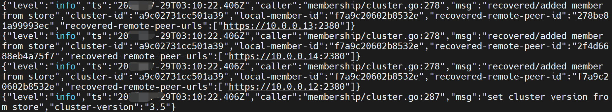

# 控制器

在k8s中，一切行为接被控制器所控制。也就是说，k8s主要有 控制层面和数据层面来组成：&#x20;

1. 控制层面&#x20;
   * API Server - 提供数据的注册和监视各种资源对象的功能&#x20;
   * Scheduler - 将资源对象调度到合适的节点中。&#x20;
   * Controller - 大量控制功能的集合,与API Server结合起来完成控制层面操作。&#x20;
2. 数据层面&#x20;
   * Etcd - 提供各种数据的存储

<figure><figcaption></figcaption></figure>

节点资源管理

<figure><figcaption></figcaption></figure>

k8s集群中的所有资源对象都是 通过控制器来进行管控


master

* 主机上的各种组件进行统一管理

node

* kubelet组件实现信息的交流。

&#x20;pod内部

* 基于CRI让应用本身是运行在容器内部。&#x20;
* 基于CSI实现各种持久化数据的保存。
* 基于CNI实现多个pod应用程序之间的通信交流。


资源访问

<figure><figcaption></figcaption></figure>

**控制流程**

在k8s中，要想对资源进行管控，需要先定义资源，然后再进行初始化，最后形成资源对象。资源对象有两种形式

文件形态 - 编写出来的资源对象文件，有大量属性组成。&#x20;

对象形态 - 基于资源对象文件初始化后出来的应用对象。

<figure><figcaption></figcaption></figure>
